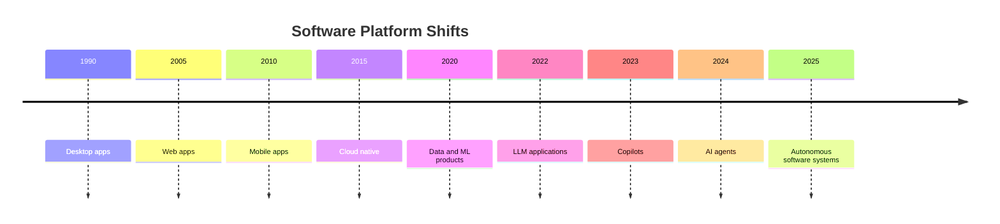
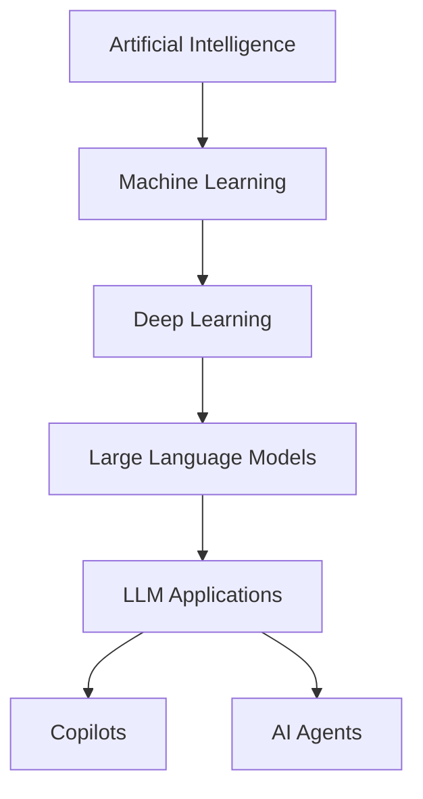
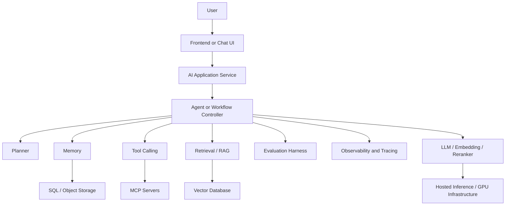
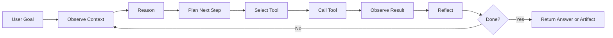
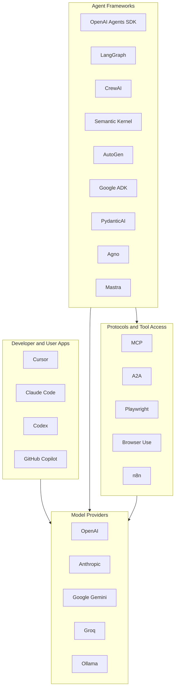
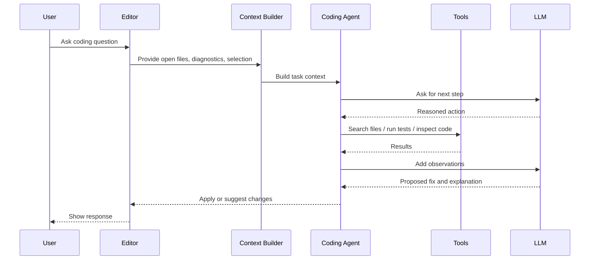

# Diagrams

GitHub renders these Mermaid diagrams automatically in Markdown.

## Software Platform Evolution

## Concept Hierarchy

## Modern AI Application Stack

## Agent Loop

## Ecosystem Map

## Cursor-Style Coding Assistant Flow

