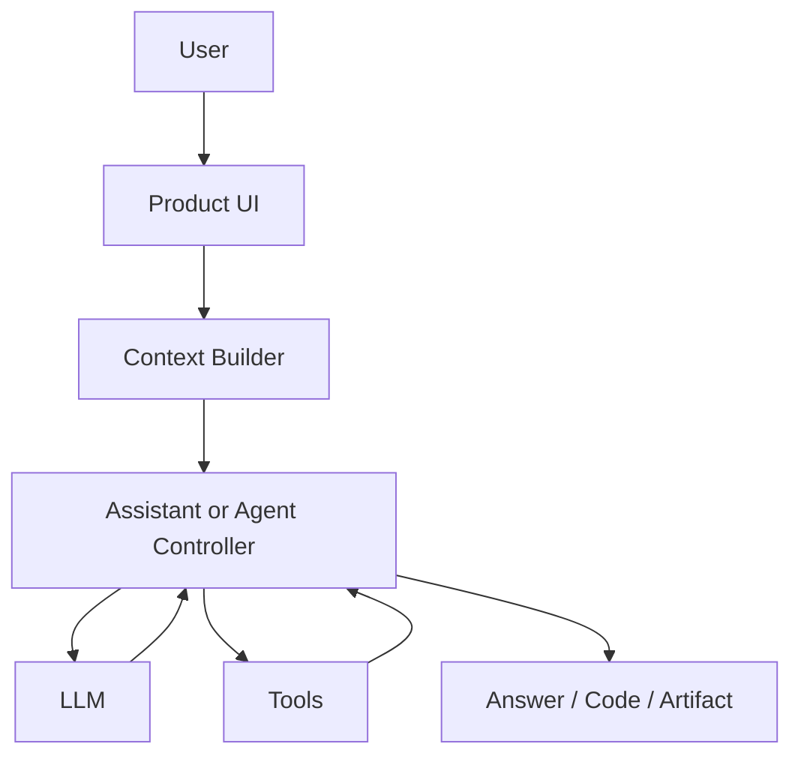

# Labs

## Lab 1: Build an AI Product Architecture Map

This lab trains you to think like an AI engineer before writing code.

## Scenario

You are evaluating four AI products:

- ChatGPT
- Claude
- Cursor
- GitHub Copilot

You are not trying to reverse engineer private internals. You are building a conceptual architecture map based on observable product behavior.

## Deliverable

Create:

```text
labs/01-foundations/ai-product-architecture-map.md
```

Include these sections:

- Product comparison table
- Architecture diagram
- Context sources
- Tool capabilities
- Memory behavior
- Human-in-the-loop points
- Risks and limitations
- What you would measure in production

## Suggested Table

| Product | Main User Interface | Context Sources | Tools | Memory | Human Approval |
|---|---|---|---|---|---|
| ChatGPT | Chat | User messages, files, tools | Web, code, files depending on mode | User/project memory depending on product settings | User decides what to trust |
| Claude | Chat/code assistant | User messages, files, project context | Tools depending on environment | Product-dependent | User approves important actions |
| Cursor | IDE | Repository, open files, diagnostics | File edits, search, terminal depending on permissions | Workspace/chat history | Developer reviews changes |
| GitHub Copilot | IDE/GitHub | File context, repository, issue/PR context | Suggestions, edits, chat actions | Product-dependent | Developer accepts changes |

## Architecture Diagram Template

Use Mermaid:



## Acceptance Criteria

- You compare at least four products.
- You separate observable behavior from assumptions.
- Your diagram includes context, model, tools, and output.
- You identify at least five production risks.
- You identify at least five metrics or signals you would monitor.

## Extension

Add a fifth product, such as Perplexity, Gemini, Claude Code, Codex, or n8n.

